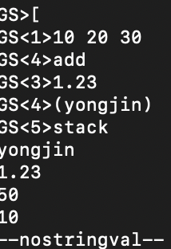

# 컴퓨터 그래픽스 공부

### 최근 수정 : 21/04/12
#### postscipt에도 스택이 존재한다. 
* count
>스택의 깊이를 스택의 맨 위에 올려둔다. 예를 들어 스택의 맨 밑에서부터 0, 1, 2, 3, 4가 들어있다고 가정한다면, 5가 스택의 맨위에 올라오게 된다.
  
* clear
>스택의 모든 데이터를 제거한다.

* pop
>가장 최근에 넣었던 값을 뺀다.

* dup
>스택의 가장 위의 객체를 복사하여 스택에 추가시킨다.
  
* stack, pstack
>스택 확인!

* ==
>해당 값을 꺼내서 print. 단순히 display해주는 것이 아니라 기존 stack에 pop을 해서 보여주는 것이므로 stack에서는 값이 사라짐.

* add, sub, mul, div, neg, div연산에서 몫만 나오게 하고싶을 경우 idiv, 나머지는 mod
>stack의 맨 위에 있는 숫자 두개를 더하거나 빼주고 그 결과값을 stack에 넣어준다. ex) 90 100 add == -> 90 + 100의 값이 print되지만 stack에 들어가진 않는다.
>(postscript는 int나 floating point를 딱히 가리지 않는다.)

* exch
>스택 상위 2개의 요소의 위치가 교환된다.

* roll
> {몇번째 객체를?} {어느 방향으로?} 치환할 것인가 ex) 4 -1 roll

* repeat
>스택에 반복해서 넣는다. ex) 5 {10} repeat -> 10 10 10 10 10

* 숫자나 다른 것들을 String으로 바꿔야 할 때
>String을 define한다. /nstr n(길이를 최대 몇자로 할것인가?) string def -> create string with length of n   
>nstr cvs 를 이용하여 string으로 바꿔준다.

* for 문
> ex) 1 1 10 {} for -> 1부터 시작해서 10까지 1을 증가시키면서 스택에 집어넣기   
> 0을 stack에 집어넣고, 1 1 10 {add} for -> 1부터 10까지의 합이 stack에 들어감. 0을 집어넣는 이유는 처음 stack에 들어갈 때 1과 add되는 수가 없기 때문에 미리 넣어주는 것.

* conditional statement
  - bool {...} if  
    > condition(bool) - eq, ne, gt, lt, ge, le  
      스택 맨위에 있는 두개를 비교한다.   
      </img> 

  - bool {op1} {op2} ifelse
    > true일 경우 op1을 실행하고, false일 경우 op2를 실행한다.

* dictionary
>/name something def   
 /ppi 72 def -> 3 ppi mul == 216
 
* array
> object이기 때문에 array안에 array를 집어넣을 수 있다.(2차원, 3차원 array 생성 가능)   
> 10 array : 크기가 10인 array 생성   
> bracket을 열어서도 array를 정의할 수 있다.    
</img>       
> 후 bracket 닫기! array의 내용을 바꾸고 싶을 경우 index 바꾸고 싶은 내용 put 명령어 사용 -> dup을 할때 object를 바꾸게 되면 다른쪽 object도 따라서 바뀌게 된다.(stack에는 원래 값이 들어있는 것이 아니라 object를 가리키고 있는 것이므로 dup를 할때 dup 한 것과 기존의 것이 같은 object를 가리키고 있기 때문)
> [2 5 9] get 1 -> 배열에서 1번 index 찾기
> forall - array에 들어있는 모든 각각에 대해 for loop을 돌면서 {exec}를 실행. ex) 0을 stack에 추가시킨 후 [1 2 3 4 5] {add} forall -> 15
> aload - array의 값을 하나씩 stack에 넣음.
> astore - array의 크기만큼 stack에서 가져와서 array에 집어넣는다. ex) array의 크기가 5인 aaa array생성, [1 2 3 4 5 6 7 8 9 10] array에서 aaa astore -> [6 7 8 9 10]이 생성.
